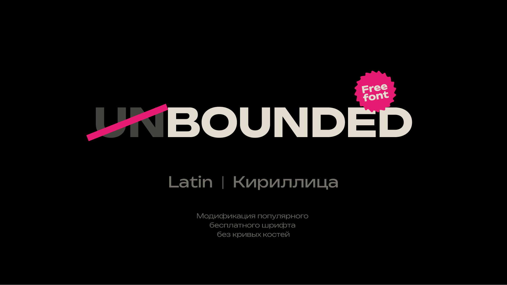
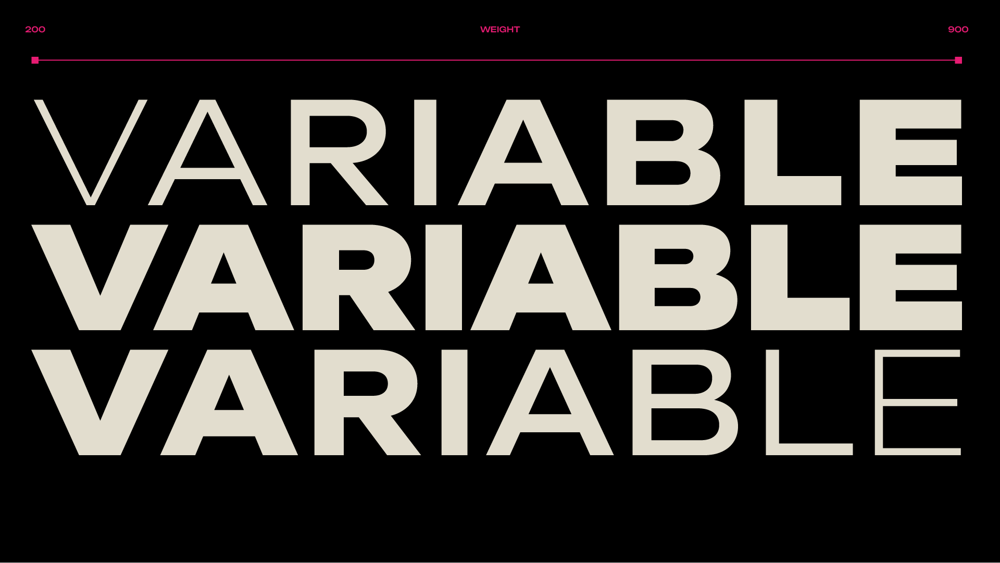
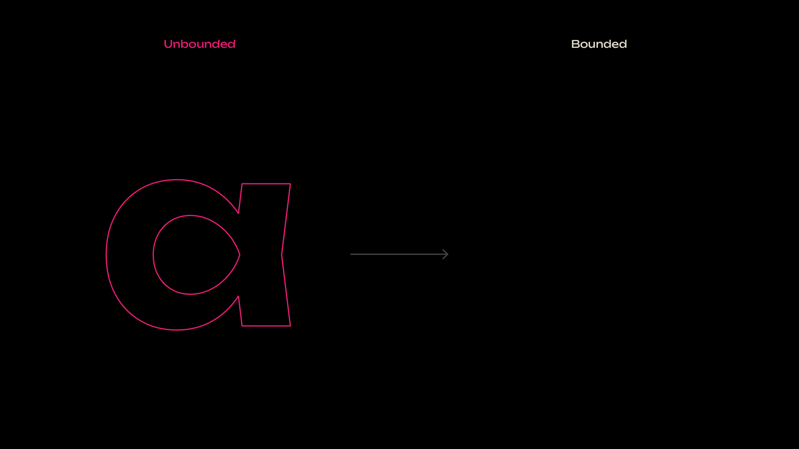
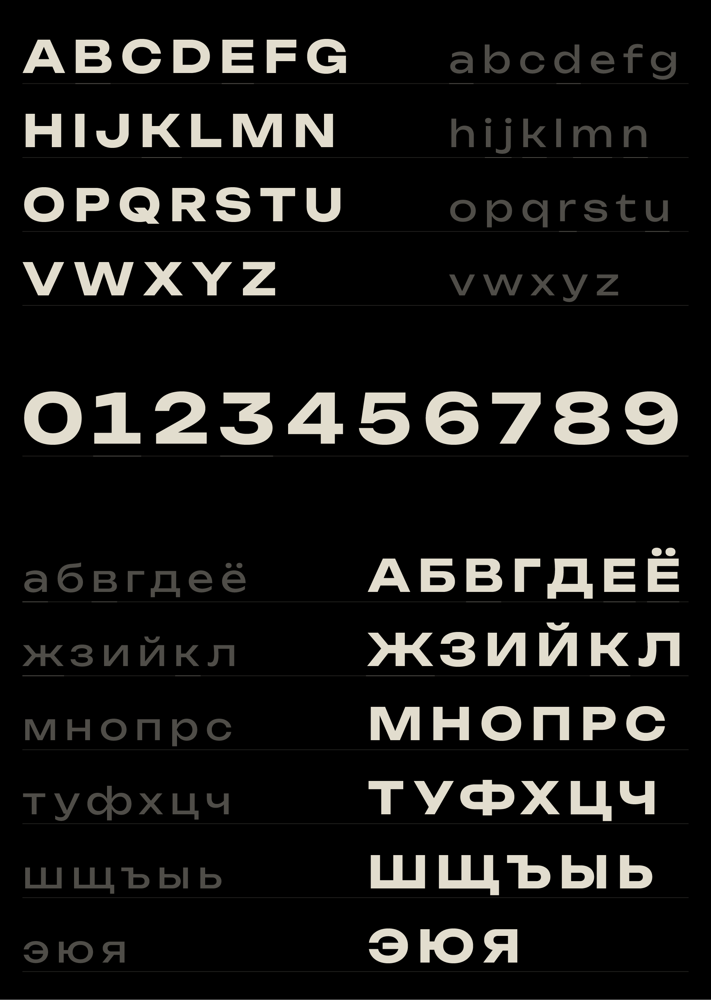

# About Bounded

The main idea of ​​this font is to make a casual version of a popular display font Unbounded.

## Available font styles

| Name       | Weight class |
| ---------- | ------------ |
| ExtraLight | 200          |
| Light      | 300          |
| Regular    | 400          |
| Medium     | 500          |
| Bold       | 700          |
| Black      | 900          |

Available also as a variable font.

## License

This Font Software is licensed under the SIL Open Font License, Version 1.1. This license is available with a FAQ at https://openfontlicense.org

## Authors

Designer Vlad Churkin
churkinvlad@gmail.com

Modification of Unbounded font designed by NaN, 
Luke Prowse, Jean-Baptiste Morizot, Fátima Lázaro, Florian Runge.

